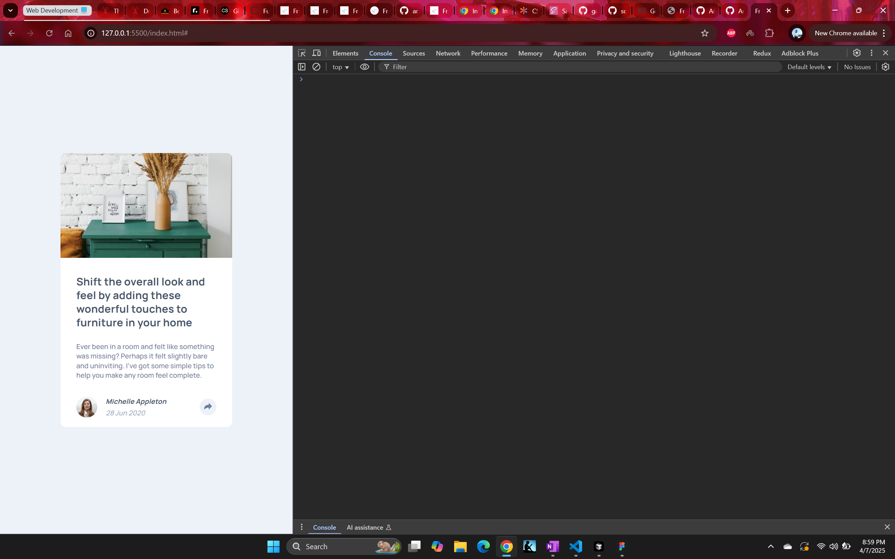
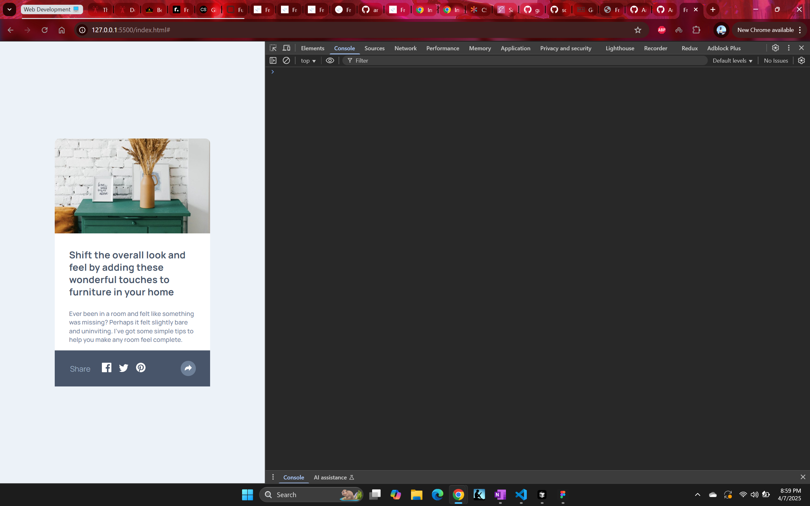
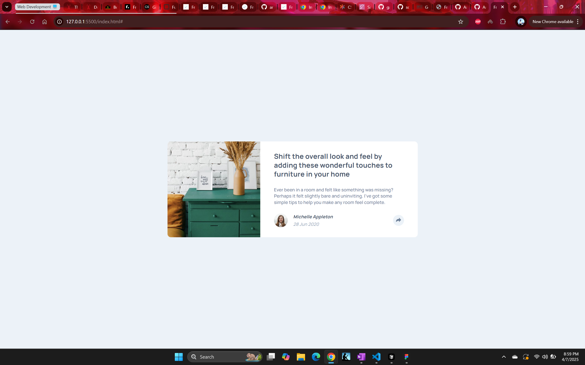
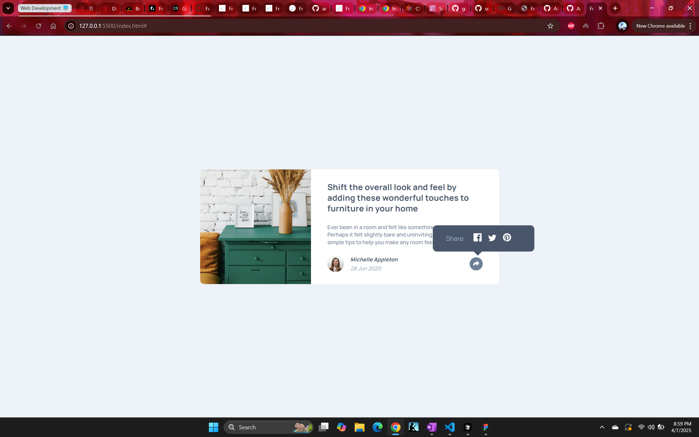

# Frontend Mentor - Article preview component solution

This is a solution to the [Article preview component challenge on Frontend Mentor](https://www.frontendmentor.io/challenges/article-preview-component-dYBN_pYFT). Frontend Mentor challenges help you improve your coding skills by building realistic projects. 

## Table of contents

- [Overview](#overview)
  - [The challenge](#the-challenge)
  - [Screenshot](#screenshot)
  - [Links](#links)
- [My process](#my-process)
  - [Built with](#built-with)
  - [What I learned](#what-i-learned)
  - [Continued development](#continued-development)
  - [Useful resources](#useful-resources)
- [Author](#author)
- [Acknowledgments](#acknowledgments)

**Note: Delete this note and update the table of contents based on what sections you keep.**

## Overview

### The challenge

Users should be able to:

- View the optimal layout for the component depending on their device's screen size
- See the social media share links when they click the share icon

### Screenshot






### Links

- Solution URL: [Github repo](https://github.com/ganeshreddychimmula/article-preview-component.git)
- Live Site URL: [Live site](https://ganeshreddychimmula.github.io/article-preview-component/)

## My process

### Built with

- Semantic HTML5 markup
- CSS custom properties
- Flexbox
- CSS Grid
- Mobile-first workflow


### What I learned

If you want more help with writing markdown, we'd recommend checking out [The Markdown Guide](https://www.markdownguide.org/) to learn more.

### Structure review 1:

```html
  <body>
    <main class="container">
      <article class="preview-article">
        <figure class="article-img-container">
          
        </figure>
        <header>
          <h2 class="article-heading">
            Shift the overall look and feel by adding these wonderful touches to
            furniture in your home
          </h2>
        </header>
        <p class="article-description">
          Ever been in a room and felt like something was missing? Perhaps it
          felt slightly bare and uninviting. I’ve got some simple tips to help
          you make any room feel complete.
        </p>
        <footer class="footer">
          <div class="profile-user">
            
            <address class="user-details">
              <h3>Michelle Appleton</h3>
              <time> 28 Jun 2020 </time>
            </address>
          </div>
          <div class="share-container">
            <nav class="navi-menu">
              <span>Share</span>
              <ul class="navigation-list">
                <li class="nav-icons">
                  <a href="#" aria-label="share on facebook">
                    
                  </a>
                </li>
                <li class="nav-icons">
                  <a href="#" aria-label="share on twitter">
                    </a>
                </li>
                <li class="nav-icons">
                  <a href="#" aria-label="share on pinterest">
                    
                  </a>
                </li>
              </ul>
            </nav>
          </div>
          <button class="share-button" aria-label="share this article">
            
          </button>
        </footer>
      </article>
    </main>
  </body>
```
Here's feedback with some suggestions for improvement(from claude):

**Strengths:**
1. Proper use of semantic elements like `<article>`, `<figure>`, `<header>`, and `<footer>`
2. Good use of `<time>` for the publication date
3. Clean organization of content sections
4. Appropriate use of `aria-label` for social sharing links
5. Alt text for images is present

**Areas for improvement:**

1. **Time element**: The `<time>` element should include a `datetime` attribute with a machine-readable format:
   ```html
   <time datetime="2020-06-28">28 Jun 2020</time>
   ```

2. **Author markup**: Consider using `<address>` for the author information:
   ```html
   <address class="user-details">
     <h3>Michelle Appleton</h3>
     <time datetime="2020-06-28">28 Jun 2020</time>
   </address>
   ```

3. **Navigation purpose**: The `<nav>` element is typically for major site navigation - for social sharing, a simple `<div>` with appropriate ARIA might be more appropriate:
   ```html
   <div class="social-share" role="group" aria-label="Share options">
     <h3>Share</h3>
     <ul class="social-list">
       <!-- items -->
     </ul>
   </div>
   ```

4. **Share button**: The share button should include a type and potentially a more descriptive label:
   ```html
   <button type="button" class="share-button" aria-label="Share this article">
     
   </button>
   ```
   Note that when the image is purely decorative and accompanied by aria-label, the alt text can be empty.

5. **Heading hierarchy**: The `<h3>` for "Share" might be reconsidered - it's not really a section heading but more of a label. Consider using a `<span>` with appropriate styling instead.

6. **Profile image**: Consider adding `aria-hidden="true"` to the profile picture since it's decorative and using empty alt text:
   ```html
   
   ```

7. **Linking**: The article title could be wrapped in a link if it's meant to lead to the full article:
   ```html
   <h2 class="article-heading">
     <a href="/full-article">Shift the overall look and feel...</a>
   </h2>
   ```

### Choosing class-names Dilemma
Here's a clean and concise summary of better class naming practices:

✅ Better Class Naming – Notes

 1. **Be Descriptive & Semantic**
- Use meaningful names that reflect purpose, not appearance.  
  E.g., `.share-button` instead of `.box1`

---

 2. **Follow BEM Convention**
- Structure: `block__element--modifier`
```html
<div class="card">
  <h2 class="card__title"></h2>
  <button class="card__button card__button--active"></button>
</div>
```

---

3. **Avoid Visual-Based Names**
- ❌ `.red-text`  
- ✅ `.error-message`

---

4. **Consistent Casing**
- Prefer `kebab-case` for HTML/CSS  
  (e.g., `share-button`, `nav-item`)

---

5. **Group by Feature/Component**
- Use structured names like:
  - `.article-preview__heading`
  - `.profile-user__avatar`

---

6. **Prefix Utility Classes (if used)**
- For reusable helpers:  
  `u-margin-top-sm`, `u-text-center`

---

Bonus Tips
- Use **SASS** for better organization (nesting, variables).
- Consider **Tailwind CSS** for utility-first workflows.

---

### I am trying to change the following svg's color. But i am not able to? why?
```html
<button
              id="share-button"
              class="article-card__share-button"
              aria-label="toggle share menu"
            >
              
            </button>
```
```Css
.article-card__share-button {
    height: 32px;
    width: 32px;
    border-radius: 90px;
align-self: center;
border: none;
z-index: 3;
background-color: var(--grey-200);
color: var(--grey-500);
}
```
why?
__answer__
It looks like you're trying to change the color of an SVG image that's included via an `` tag, but you're running into issues. The reason this isn't working is that when you use an SVG as an external image with the `` tag, you can't modify its colors using CSS.

Here are a few solutions to make your SVG color changeable:

**Option 1: Use inline SVG instead of an image**
Replace the `` tag with the actual SVG code directly in your HTML. This allows you to target SVG elements with CSS:

```html
<button
  id="share-button"
  class="article-card__share-button"
  aria-label="toggle share menu"
>
  <svg width="15" height="13" xmlns="http://www.w3.org/2000/svg">
    <!-- Your SVG path data here -->
    <path d="M15 6.495L8.766.014V3.88H7.441C3.33 3.88 0 7.039 0 10.936v2.049l.589-.612C2.59 10.294 5.422 9.11 8.39 9.11h.375v3.867L15 6.495z" fill="currentColor"/>
  </svg>
</button>
```

Then in your CSS, `currentColor` will inherit from the `color` property of your button:

```css
.article-card__share-button {
  /* Your existing styles */
  color: var(--grey-500); /* This will be inherited by the SVG */
}

.article-card__share-button--active {
  /* Your existing styles */
  color: var(--white); /* This will change the SVG color when active */
}
```

**Option 2: Use an SVG as a background image**

Replace the `` tag with a background image:

```html
<button
  id="share-button"
  class="article-card__share-button"
  aria-label="toggle share menu"
></button>
```

```css
.article-card__share-button {
  /* Your existing styles */
  background-image: url('./images/icon-share.svg');
  background-position: center;
  background-repeat: no-repeat;
  background-size: 15px; /* Adjust to match your icon size */
}

.article-card__share-button--active {
  /* Your existing styles */
  filter: brightness(0) invert(1); /* This will make the icon white */
}
```

### Option 3: Use SVG with CSS mask
This approach is great for changing colors:

```html
<button
  id="share-button"
  class="article-card__share-button"
  aria-label="toggle share menu"
></button>
```

```css
.article-card__share-button {
  /* Your existing styles */
  background-color: var(--grey-500); /* This will be the icon color */
  -webkit-mask: url('./images/icon-share.svg') no-repeat center;
  mask: url('./images/icon-share.svg') no-repeat center;
  -webkit-mask-size: 15px; /* Adjust to match your icon size */
  mask-size: 15px;
}

.article-card__share-button--active {
  background-color: var(--white); /* This changes the icon color when active */
}
```

The third option is especially powerful for changing colors of SVGs without modifying the original file.


### Useful resources

- [Chrome Lighthouse ](https://developer.chrome.com/docs/lighthouse/overview) - This helped me improve performance, accesibility and SEO of my pages. I really liked this  and will use it going forward.


## Author

- Frontend Mentor - [@ganeshreddychimmula](https://www.frontendmentor.io/profile/ganeshreddychimmula)


## Acknowledgments

This is where you can give a hat tip to anyone who helped you out on this project. Perhaps you worked in a team or got some inspiration from someone else's solution. This is the perfect place to give them some credit.

https://github.com/S4V10N/article-preview-component-master/tree/main
https://www.frontendmentor.io/solutions/html-css-js-grid-flexbox-scss-mobile-firts-chrome-vSfyPfV2OA#comment-67f41e24eecb67f63dd60d31
